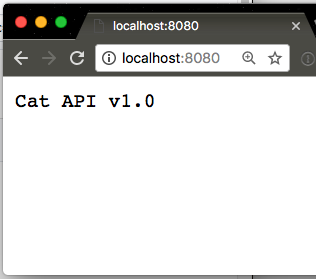

# Server Side Swift w/ Vapor - Part II
An intro to Server Side Swift using Vapor
---

### Readings:

1. [Controllers - Vapor Docs](https://docs.vapor.codes/2.0/vapor/controllers/)
2. [Basic Controllers - RW](https://videos.raywenderlich.com/screencasts/533-server-side-swift-with-vapor-basic-controllers)
3. [RESTful Controllers - RW](https://videos.raywenderlich.com/screencasts/537-server-side-swift-with-vapor-restful-controllers)

### Helpful Resources:
1. [Vapor - Big Nerd Ranch](https://www.bignerdranch.com/blog/server-side-swift-with-vapor/)

### API Reference: 
1. [Vapor API Reference](http://api.vapor.codes/)

---

### Notice: 

Vapor has been updated to 2.0 as of yesterday. There are a number of changes that we'll need to go through. Refer to the [Vapor 2.0 Docs](https://docs.vapor.codes/2.0/) as needed.

> To get the code for our current implementation of `Cat`, check out this [gist](https://gist.github.com/spacedrabbit/ccf3b9cb2b716678305902e6fe61c9c0)
> To get the code for our current `main.swift` file, check out this [https://gist.github.com/spacedrabbit/904c1df9eca0f899aab3c7df5810b02a]

#### Updating our Cat model:

In order to keep our current conformance to `NodeRepresentable`, `JSONRepresentable` and `ResponseRepresentable`, we'll need to make a series of changes to our model. 

1. We'll want to include `required init(node:) throws` which is part of the `NodeInitializable` protocol. 
2. Change our previous `init` into a `convenience init` that calls our new `init`
3. Change our `let`s to `vars`
4. Standardize our keys to use camel case: `cat_name, cat_breed, cat_snack`
5. Move out all other code to individual extensions. You should have: 

```swift 
class Cat: NodeInitializable {
  var name: String!
  var breed: String!
  var favoriteSnack: String!
  
  required init(node: Node) throws {
    guard
      let catName = node["cat_name"]?.string,
      let catBreed = node["cat_breed"]?.string,
      let catSnack = node["cat_snack"]?.string
    else {
        throw Abort.badRequest
    }
    
    name = catName
    breed = catBreed
    favoriteSnack = catSnack
  }
  
  convenience init(name: String, breed: String, snack: String) throws {
    try self.init(node: ["cat_name":name, "cat_breed":breed, "cat_snack":snack])
  }
}

```

Following that, we should have our other protocols defined in extensions for clarity.

> Notice: we used the `NodeInitializable` protocol to slim down our code significantly

```swift
// MARK: - NodeRepresentable
extension Cat: NodeRepresentable {
  func makeNode(in context: Context?) throws -> Node {
      return try Node(node: self)
    }
}

// MARK: - JSONRepresentable
extension Cat: JSONRepresentable {
  // The JSON(node:) signature expects something that is NodeConvertible, so we dont need to do much here
  func makeJSON() throws -> JSON {
    return try JSON(node: self)
  }
}

// MARK: - ResponseRepresentable
extension Cat: ResponseRepresentable {
  func makeResponse() throws -> Response {
    return try Response(status: .ok, json: self.makeJSON())
  }
}
```

---

### Controllers

Up until now, we've understood **controllers** to be entities in the MVC architecture whom are responsible for *controlling*/coordinating communications between Models and Views. But the concept of a controller extends beyond what is covered in MVC -- controllers are more generally considered entities that coordinate or organize communication between/for other entities. In the realm of server-side swift, controllers are used to organized related functionality in a single place. 

We're first going to take a look at how to move our code for our routes into separate (basic) controllers. We'll then update our `Cat` models to be fully fledged Vapor `Models`. Following that, we'll update our routes to be RESTful by implementing the `ResourceRepresentable` protocol on our controller. 

#### No one `Control(ler)`s cats!

Right now, there are far too many things going on in our `main.swift` file. It also isn't going to scale well at all. We should probably move out some of the related code to different files, perhaps a single `CatsController.swift` file!

> Create a new Swift file called `CatsController` and add it to the `Controllers` folder (make sure you select the proper target)

Our `CatsController` is going to do some of our registering and routing for us so that we can get some messy code out of `main`. Let's start off with this:

```swift
import Foundation
import Vapor
import HTTP

final class CatsController {
  
  func addRoutes(drop: Droplet) {
    
  }
  
}
```

We're going to use `addRoutes(drop:)` to register all of our various routes. We'll begin by defining a new function, `version` to display some info about the api. 

```swift   
	func version(request: Request) throws -> ResponseRepresentable {
    	return "Cat API v1.0"
  	}
 ```

Now to register the route, it is very similar to how we did it in main, except that we define a handler closure that matches the type `(Request) throws -> ResponseRepresentable`:

```swift
	func addRoutes(drop: Droplet) {
    	drop.get("", handler: version)
	}
 ```

Now run your project and go to `localhost:8080`



**Exercise Set 1:**
Implement 4 more routes: `/cats, /cats/:type, /error/no-cats, /error/sleeping-cats` corresponding to three functions: `getAllCats(request:)`, `getSomeCats(request:)`, `noCatsError(request:)`, and `sleepingCatsError(request:)`

*Note:*
- Register each route in `addRoutes` after having defined their handler functions
- Ensure your function types are appropriate to the signature that `drop.get` expects
- Attempt to create a custom error message for `/error/sleeping-cats`

---

**Exercise Set 2:**
1. Rewrite your `/cats` endpoint to return an array of `Cat` objects
2. Rewrite your `/cats/:type` endpoint to return a single `Cat` with the `breed` of type `:type`. 
3. Create a new `POST` endpoint called `/cats/add` that accepts `JSON` to create an instance of a new `Cat`. Have it return a `JSON` response of `{success: true}` if it worked, throw an error otherwise. 

---

### RESTful Controllers (Intermediate Routing)

You may recall that the RESTful API's we've consumed in the pass all generally had the same set of endpoints to hit: one for getting a single object, another for creating a new object, another for updating it, another for deleting, etc.. Well, Vapor knows that Swift developers would want to create a similar structure for their code. And such, they added the `ResourceRepresentable` protocol. The `ResourceRepresentable` protocol more easily allows you to handle common RESTful requests. 

> Create a new file, `KittenRESTController.swift`

The code starts out simple enough, as `ResourceRepresentable` only has one required method `makeResource() -> Resource`

```swift
final class KittenRESTController: ResourceRepresentable {
  func makeResource() -> Resource<Cat> {
    
    return Resource()
  }
}
```

Though if we try to build at this point, we're met with an error: 


Well, I guess that just means we'll need to make our `Cat` model a fully fledged Vapor `Model` type. But we'll leave that for next time 😇